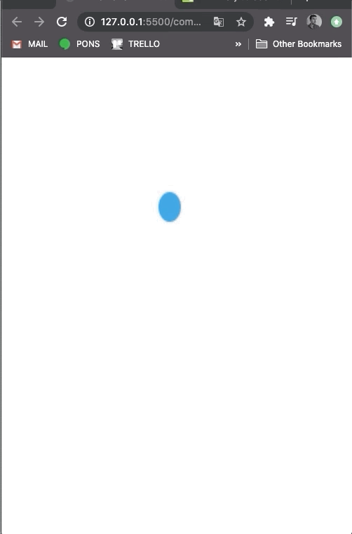
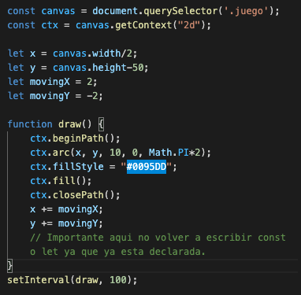
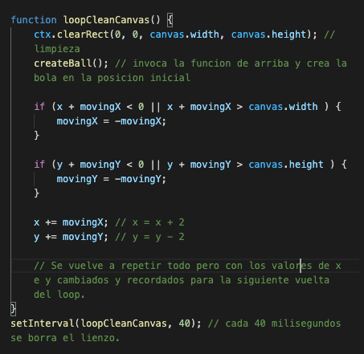
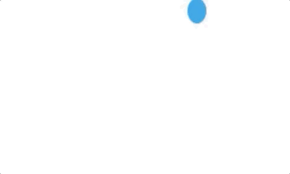
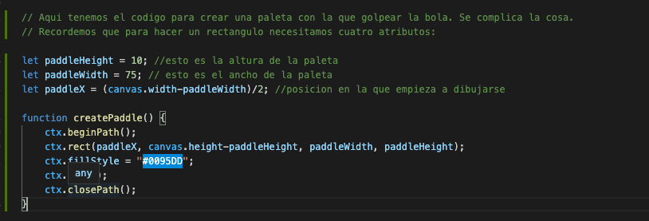
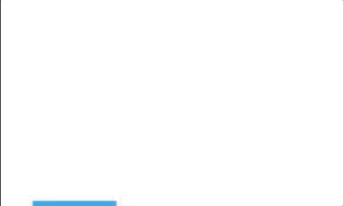
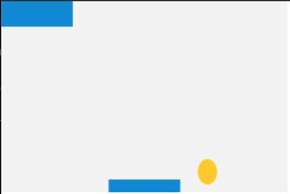
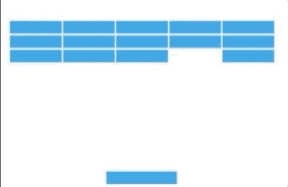
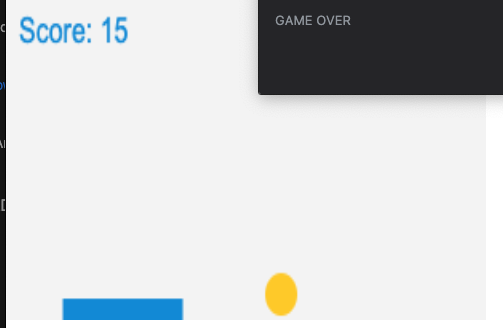

# Instrucciones de hacer el juego

La idea y lo que tenemos que saber es que para mover un objeto por la pantalla, es necesario hacer el siguiente proceso:
- Pintar la pelota en pantalla.
- Borrarla.
- Pintarla en una posicion ligeramente diferente cada fotograma para dar la impresion de movimiento.

Es decir que tenemos que crear un bucle de dibujo.
https://developer.mozilla.org/es/docs/Games/Workflows/Famoso_juego_2D_usando_JavaScript_puro/Mueve_la_bola

Eso es lo que va a hacer luego la funcion de requestAnimationFrame() o la funcion de setInterval(): definir un tiempo.

### Empezar creando el canvas y el getContext("2D):

const canvas = document.querySelector('.juego');\
const context = canvas.getContext("2d");

### Crear un circulo verde

context.beginPath();\
context.arc(220, 100, 20, 0, Math.PI*2, false);\
context.fillStyle = "green";\
context.fill();\
context.strokeStyle = "blue";\
context.stroke();\
context.closePath();\

### Crear un rectangulo

context.beginPath();\
context.rect(20, 40, 50, 50);\ (el primer y el segundo valor son las coordenadas x e y dnd empieza el rect y las otras dos son el ancho maximo y la altura maxima)\
context.fillStyle = "red";\
context.fill();\
context.strokeStyle = "blue";\
context.stroke();\
context.closePath();

### Operadores chungos

x += movingX es lo mismo que x = x + movingX \
y += movingY es lo mismo que y = y + movingY

## Pasos
1. Vamos a crear una funcion que lo que haga sea actualizar el dibujo cada 10 segundos. La funcion se va a llamar draw() o loopCleanCanvas y luego la vamos a llamar con setInterval(loopCleanCanvas, 10);

2. Para ello lo primero es quitar lo de 50, 50 en la posicion de la pelota y vamos a crear las variables x e y dentro de draw para que luego podamos manipularlo.
 	const x = canvas.width/2;
    const y = canvas.height-30;

3. Vamos a crear una especie de loop ya que vamos a crear otras dos variables que nos vayan a modificar la posicion inicial de x e y.\




4. Ahora introducimos un metodo que lo que nos hace es que nos va a borrar el rastro del frame anterior, porque no queremos tener la estela de la bola, sino que se mueva de forma fluida. Esta funcion es ``ctx.clearRect()``. Dentro se le meten cuatro parametros, que son las medidas del principio del lienzo, del canvas (0, 0) y luego las del final (canvas.width, canvas.heigth).
Hay que meter esto antes de beginPath():
```js
ctx.clearRect(0, 0, canvas.width, canvas.height);
```
5. Por motivos de orden y limpieza, vamos a separar las distintas funciones que dibujan la bola y que limpian el canvas.

```js
function createBall() {
    ctx.beginPath();
    ctx.arc(x, y, 10, 0, Math.PI*2);
    ctx.fillStyle = "#0095DD";
    ctx.fill();
    ctx.closePath();
}

function loopCleanCanvas() {
    ctx.clearRect(0, 0, canvas.width, canvas.height); // limpieza
    createBall(); // invoca la funcion de arriba y crea la bola en la posicion inicial
    x += movingX; // modify x value
    y += movingY; // modify y value
```

6. Ahora lo que vamos a hacer es que nuestra querida pelota rebote por las paredes. Para ello, vamos a meterle una deteccion de colision simple.
https://developer.mozilla.org/es/docs/Games/Workflows/Famoso_juego_2D_usando_JavaScript_puro/Bounce_off_the_walls

Para hacerlo mas facil, vamos a meterle un valor al circulo llamado ``let ballRadius = 10``, que es el valor que siempre le hemos puesto en el ``ctx.arc(x, y, 10, 0, Math.PI*2)``. Pero ahora lo ponemos con ballRadius para poder manipular el valor.

Tenemos que pensar que tenemos 4 paredes a las que tenemos que acceder de alguna forma. Empecemos con los rebotes arriba y abajo. **Basicamente lo que tenemos que comprobar cada fotograma es si la pelota esta tocando el borde superior del canvas y si es asi que cambie a la direccion opuesta.**

Rebote arriba se crea diciendole al programa que si en algun momento la movingY llega a ser negativa que la transforme en positiva, es decir, que vaya hacia abajo.
Tambien podemos hacer lo mismo con el otro lado, si en algun momento la suma de y + el movimiento de y es superior a la altura del canvas, entonces se revierte el movimiento de y.

```js
if (y + movingY < 0) {
        movingY = -movingY;
	}
if (y + movingY > canvas.height) {
        movingY = -movingY;
    }
```
Tambien se puede poner en una linea y si lo aplicamos al eje de la x funciona. ***La magia aqui es que te establece que 0 en la primera funcion es la parte de la izquierda del canvas mientras que el 0 de la funcion siguiente es la parte de arriba del canvas***.

```js
  	if (x + movingX < 0 || x + movingX > canvas.width ) {
        movingX = -movingX;
    }

    if (y + movingY < 0 || y + movingY > canvas.height ) {
        movingY = -movingY;
    }
```
Automaticamente despues de la funcion ponemos lo de
x += movingX;
y += movingY;



- Primero limpia el canvas
- Luego crea la bola y dice que pasa si esta en la posicion 0 o final
- luego cambia la posicion de la bola
- se activa el loop (el cambio de posicion de la bola se debe dar al final)

7. Sin embargo, se ve la bola salir un poco. Esto es porque te esta haciendo la colision de la pared con el centro de la bola, mientras que deberiamos hacerlo con la circunferencia (el contorno).

El radio es la longitud del centro a la circunferencia. Es la mitad del diametro siempre. En este caso es 10 porque lo hemos asignado. 
- Gracias a eso le podemos decir que en el momento que el radio sea menor que cualquiera de los ejes, que cambie la direccion. 
- Y luego que cuando la direccion de la bola sea mayor que el final del canvas (tanto x como y) - el radio de la bola, que cambie tambien la direccion. 

Por lo cual le tenemos que decir en todo momento que tenga en cuenta el ballRadius para que el cambio de direccion lo haga antes.

```js
 	if (x + movingX < ballRadius || x + movingX > canvas.width - ballRadius ) {
        movingX = -movingX;
    }

    if (y + movingY < ballRadius || y + movingY > canvas.height - ballRadius ) {
        movingY = -movingY;
    }
```


### Interaccion del usuario

Vamos a meterle un poco de interaccion y crear una pala con la que poder golpear la pelota.
Para ello vamos a establecer las variables de la altura, el ancho, y su posicion con respecto al ejex. Y luego vamos a crear una funcion que sea la de dibujar la pala.


## Controles de teclado

Vamos a necesitar hacer lo siguiente:
1. Crear variable para guardar la info de si se pulsa la tecla izquierda o derecha.
2. Dos funciones addEventListener que respondan a keydown (se pulsa la tecla) y keyup (se libera). Vamos a hacer que ocurra algo con la paleta cuando se pulsen los botones.
3. Dos funciones que manejen los eventos keydown y keyup que hemos hecho antes.
4. La habilidad de mover la paleta a la izquierda y a la derecha.

VAMOS AL LIO

1. Creamos las dos variables para lo de izquierda y derecha. Por default y hasta que no hagamos algo: false.

```js
let rightPressed = false;
let leftPressed = false;

```

2. Ahora vamos a crear dos addEventListener para definir que el programa escuche cuando se pulsa una tecla. Esto se mete justo antes de setInterval().
```js
document.addEventListener("keydown", keyDownHandler, false);
document.addEventListener("keyup", keyUpHandler, false);
```

3. Ahora lo que vamos a hacer es que se conecten las tres cosas: el keydown, el handler y el false. Queremos que cuando se produzca el keydown (que ya es algo definido), se active el keyDownHandler y una vez se deje de pulsar la tecla se activara el keyup con el keyUpHandler.

Se crea la variable (e) de evento, que nos va a permitir almacenar la informacion. Para eso la utilizamos, es ahi donde guardamos la informacion que vamos a conseguir de keyDownActivator por un lado y luego otra variable (e) recoge la info cuando se active el keyup.

```js 
function keyDownActivator(e) {
    if(e.keyCode == 39) {
        rightPressed = true;
    } else if(e.keyCode == 37) {
        leftPressed = true;
    }
}

function keyUpActivator(e) {
    if (e.keyCode == 39) {
        rightPressed = false;
    } else if(e.keyCode == 37) {
        leftPressed = false;
    }
}
``` 

Y ya lo que nos falta es decirle al programa que es lo que pasaria si es true la funcion de keydownhandler para ambas teclas, es decir, crear el movimiento.

4. Nos vamos a la parte del loop y le decimos lo siguiente:

```js
if(rightPressed) {
    paddleX += 7;
}
else if(leftPressed) {
    paddleX -= 7;
}
```

Ahora ya funciona, el problema es que la paleta puede desaparecer de los limites del canvas. Le ponemos limites con el operador && y le decimos que puede hacer eso siempre que rightPressed sea true y que paddle X sea menor que el final del width - paddleWidth. Y lo mismo con el de la izquierda, siempre que leftPressed sea true y que el paddleX sea mayor que cero, se podra mover a la izquierda.

```js
if(rightPressed && paddleX < canvas.width - paddleWidth) {
        paddleX += 7;
    }
    else if(leftPressed && paddleX > 0) {
        paddleX -= 7;
    }
```

### CREAR UN GAME OVER

Ahora tenemos la paleta con los movimientos que queremos y tal, pero todavia no podemos:
- ni darle a la pelota
- ni perder.

Vamos a empezar por perder. Para ello, lo unico que tenemos que hacer es permitir que la pelota rebote en las paredes izquierda, derecha y superior, pero que cuando toque en la inferior salte un elseif con un alert de game over y que recargue la pagina de nuevo.

### Tema interesante: crear una colision simple entre la paleta y la pelota.

Parecia complicado al principio, pero tiene su logica. En el momento en el que le damos la condicion de que `la y + movingY va a ser mayor que el canvas.height - ballRadius` van a suceder dos cosas: si la pelota esta entre los limites de la paddle, es decir entre el paddleX que es el principio y la suma del paddleX + paddleWidth, rebotara. Si no, game over.
```js
    if (x + movingX > canvas.width - ballRadius || x + movingX < ballRadius ) {
        movingX = -movingX;
    }

    if (y + movingY < ballRadius ) {
        movingY = -movingY;
    } else if (y + movingY > canvas.height - ballRadius) {
        if(x > paddleX && x < paddleX + paddleWidth) {
            movingY = -movingY;
        }
        else {
            
            document.location.reload();
            // alert("GAME OVER");
        }
    }
```


Ahora vamos a otro tema interesante, para que el juego no se nos haga aburrido, vamos a crear unos ladrillitos que podamos romper. Este es el sexto paso de los diez pasos de la pagina del MDN.
https://developer.mozilla.org/es/docs/Games/Workflows/Famoso_juego_2D_usando_JavaScript_puro/Construye_grupo_bloques

### CREAR UN MURO DE LADRILLOS

Esto se va a complicar. Lo primero que hacemos es crear unas cuantas variables que nos den valores sobre los ladrillos. Vamos a crear el numero de filas y columnas, el ancho y el alto de cada ladrillo, un padding para que no se toquen entre ellos y finalmente unos margenes top y left para que no esten pegados a los bordes del canvas.

```js
var brickRowCount = 3;
var brickColumnCount = 5;
var brickWidth = 75;
var brickHeight = 20;
var brickPadding = 10;
var brickOffsetTop = 30;
var brickOffsetLeft = 30;
```

#### La matriz dimensional

Ahora vamos a crear la funcion o array que prepare la disposicion de los ladrillos. Vamos a utilizar la funcion for y en el index vamos a utilizar c para las columnas y r para las filas. El maximo de length tipico que se utiliza en el for lo vamos a limitar con brickRowCount y brickColumnCount. Se habla de un bucle dentro y otro de fuera por dos razones.

     bucle: 0, 0, 0, 0, 0
            0, 0, 0, 0, 0
            0, 0, 0, 0, 0

El ultimo ladrillo es el [2][4]. Nosotros lo que le decimos al programa con el bucle creado es que primero empiece a mirar la columna 0, que es la primera y que dentro de esa matriz o Array, haga la funcion de ir creando las columnas hasta que llegue al maximo, una vez termine empezara con la columna 1 y empezara a rellenar ladrillos hasta el [1][2]. Y asi hasta que esten todos listos.

```js
var bricks = [];
for(c=0; c<brickColumnCount; c++) {
    bricks[c] = [];
    for(r=0; r<brickRowCount; r++) {
        bricks[c][r] = { x: 0, y: 0 };
    }
}
```

Lo siguiente que vamos a hacer es crear los bloques en pantalla con la funcion createBricks() y dentro le vamos a explicitar algo muy parecido a lo anterior con la diferencia de que le aclaramos que empiece en posicion 0. Tambien vamos a crear ya los bloques. Dentro del bucle de dentro.

```js
function createBricks() {
    for(c=0; c<brickColumnCount; c++) {
        for(r=0; r<brickRowCount; r++) {
            bricks[c][r].x = 0;
            bricks[c][r].y = 0;
            ctx.beginPath();
            ctx.rect(0, 0, brickWidth, brickHeight);
            ctx.fillStyle = "#0095DD";
            ctx.fill();
            ctx.closePath();
        }
    }
}
```


Ahora lo que vamos a hacer es distribuir los ladrillos... porque claro, ahora tenemos todas en la misma posicion.

Eso se hace con las siguientes declaraciones:

```js
let brickX = (c*(brickWidth+brickPadding))+brickOffsetLeft;
let brickY = (r*(brickHeight+brickPadding))+brickOffsetTop;

```

Luego hay que meterlo en la funcion de createBricks() que estamos creando:
```js
function createBricks() {
    for(c=0; c<brickColumnCount; c++) {
        for(r=0; r<brickRowCount; r++) {
            let brickX = (c*(brickWidth+brickPadding))+brickOffsetLeft;
            let brickY = (r*(brickHeight+brickPadding))+brickOffsetTop;
            bricks[c][r].x = brickX;
            bricks[c][r].y = brickY;
            ctx.beginPath();
            ctx.rect(brickX, brickY, brickWidth, brickHeight);
            ctx.fillStyle = "#0095DD";
            ctx.fill();
            ctx.closePath();
        }
    }
}
```
En este punto no entiendo muy bien la declaracion de variables anterior. Desde que empezamos con lo del for dentro del for me perdi un poco y luego a partir de ahi hemos utilizado lo de brickX y brickY para calcular los puntos de comienzo de cada uno de los ladrillos. 


### CREANDO COLISIONES CON LOS LADRILLOS.

De primeras, no hay una funcion del canvas que nos permita averiguar si la bola esta tocando el rectangulo. La forma mas sencilla de controlarlo es comprobando si el centro de la bola esta tocando cualquiera de los ladrillos.

Vamos a crear una funcion que compruebe en cada fotograma si los ladrillos han sido tocados por la bola. Para ello necesitamos la variable b de brick que utilizaremos para almacenar esa informacion.

```js
function collisionDetection() {
      for(c=0; c<brickColumnCount; c++) {
        for(r=0; r<brickRowCount; r++) {
            var b = bricks[c][r];
            // calculations here
}
```

Ahora tenemos que crear la condicional que diga que si la bola esta dentro de las coordenadas de uno de los ladrillos, hay que cambiar la direccion del ladrillo.
Para ello se tienen que cumplir estas cuatro condiciones:
- la posicion x de la bola es mayor que la x inicial del ladrillo
- la posicion x de la bola es menor que la inicial del ladrillo + su ancho
- la posicion y de la bola es mayor que la x inciial del ladrillo
- la posicion y de la bola es menor que la inicial del ladrillo + su altura

```js
function collisionDetection() {
    for(c=0; c<brickColumnCount; c++) {
        for(r=0; r<brickRowCount; r++) {
            var b = bricks[c][r];
            if(x > b.x && x < b.x+brickWidth && y > b.y && y < b.y+brickHeight) {
                movingY = -movingY;
            }
        }
    }
}

```
Ahora mismo funcionaria, lo que pasa es que los ladrillos no desaparecen los muy jedidos. Para hacer qeu desaparezcan primero vamos a meterle el status 1 a la funcion de los ladrillos que teniamos antes. Tanto en la variable como en la funcion de createBricks.

```js
var bricks = [];
for(c=0; c<brickColumnCount; c++) {
    bricks[c] = [];
    for(r=0; r<brickRowCount; r++) {
        bricks[c][r] = { x: 0, y: 0, status: 1 };
    }
}

function createBricks() {
    for(c=0; c<brickColumnCount; c++) {
        for(r=0; r<brickRowCount; r++) {
            if (bricks[c][r].status == 1) {
                var brickX = (c*(brickWidth+brickPadding))+brickOffsetLeft;
                var brickY = (r*(brickHeight+brickPadding))+brickOffsetTop;
                bricks[c][r].x = brickX;
                bricks[c][r].y = brickY;
                ctx.beginPath();
                ctx.rect(brickX, brickY, brickWidth, brickHeight);
                ctx.fillStyle = "#0095DD";
                ctx.fill();
                ctx.closePath();   
            }
        }
    }
}
```
Le vamos a decir al programa que si status vale 1 se dibuja el ladrillo pero que si vale 0 que no, porque eso significara que ha sido golpeado por la bola. 

Para eso solo hay que modificar la funcion de collissionDetection():
```js
function collisionDetection() {
    for(c=0; c<brickColumnCount; c++) {
        for(r=0; r<brickRowCount; r++) {
            var b = bricks[c][r];
            if(b.status == 1) {
                if(x > b.x && x < b.x+brickWidth && y > b.y && y < b.y+brickHeight) {
                    dy = -dy;
                    b.status = 0;
                }
            }
        }
    }
}
```
y anadir la funcion collissionDetection() al loop justo despues de createPaddle().


### Crear un marcador

1. Primero necesitamos crear la variable con let score = 0;
2. Luego necesitamos crear la funcion createScore para mostroslo por pantalla.

```js
function createScore() {
    ctx.font = "16px Arial";
    ctx.fillStyle = "ffce00";
    ctx.fillText("Score: "+ score, 8, 20);
}
```

Con respecto a fillText tenemos tres parametros, el texto y las dos coordenadas. El fillStyle se aplica al texto en si, claro.

3. En lo de collissiondetection, cuando dijimos que si se le daba a un ladrillo, desapareciera, tambien le vamos a sumar una de score.

```js
function collisionDetection() {
    for(c=0; c<brickColumnCount; c++) {
        for(r=0; r<brickRowCount; r++) {
            var b = bricks[c][r];
            if (b.status == 1) {
                if(x > b.x && x < b.x+brickWidth && y > b.y && y < b.y+brickHeight) {
                    movingY = -movingY;
                    b.status = 0;  
                    score++;
            }
            
            }
        }
    }
}
```
4. Llamamos la funcion con createScore() en el loop.\



5. Creamos tipico mensaje de victoria cuando lleguemos a 15. 

```js
function collisionDetection() {
    for(c=0; c<brickColumnCount; c++) {
        for(r=0; r<brickRowCount; r++) {
            var b = bricks[c][r];
            if (b.status == 1) {
                if(x > b.x && x < b.x+brickWidth && y > b.y && y < b.y+brickHeight) {
                    movingY = -movingY;
                    b.status = 0;  
                    score++;
                    if(score == 15) {
                        alert("YOU WIN, CONGRATULATIONS");
                        document.location.reload();
                    }
            }
            
            }
        }
    }
}
```